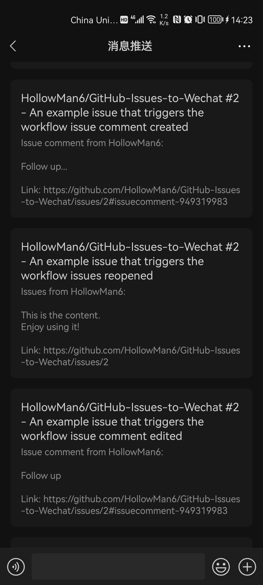

# Send timed message to Wechat

(中文版本在下方)

Send GitHub Issues, PRs or Discussions Updates to Wechat

Source Github Repository Link: https://github.com/HollowMan6/GitHub-Issues-to-Wechat

### Please **★Star** if you think it's great!

[Python library dependency](https://github.com/HollowMan6/GitHub-Issues-to-Wechat/network/dependencies)

[Source Code](GitHub-Issues-to-Wechat.py)

### Example [Workflow](.github/workflows/message.yml)

## Usage

you can fork this repository first, and then create Actions Secrets and set related settings in your forked repository (click in the order of 1, 2 and 3 as shown in the figure below).

You can choose one or more of the following three push platforms to receive pushed messages:

### PushPlus(Recommended)

First [log into pushplus](https://www.pushplus.plus/push1.html), and then find your token in pushplus website, create a actions secret with the name of `PPTOKEN` and the value of your token value, and then one-to-one push the related information results.

If you need to push the related information to multiple Wechat accounts, that is, one-to-many push, you need to create a group, write down the group code, and then create an actions secret with the name of `PPTOPIC` and the value of your group code.

### Wecom push by Wechat 

1. First register [Wecom](https://work.weixin.qq.com/wework_admin/loginpage_wx).
2. After successful registration, obtain the Company ID and create an actions secret with the name of `CORPID` and the value of your Company ID.

3. Select `App Management` → `Apps` → `Create an app`.

1. After the creation, obtain the secret and AgentId, and create actions secret with the name of `CORPSECRET` and `AGENTID` and the value of these values respectively. 

1. Enter `My Company` → `WeChat Workplace`, pull to the bottom and scan the QR code. After following, you can receive the push message.

### ServerChan

If you want to use [ServerChan](https://sct.ftqq.com/), please create/modify the Actions secret with the Name `SERVERCHANSCKEY` and the value [your sendkey value](https://sct.ftqq.com/sendkey).

### Input

* SERVERCHANSCKEY: ServerChan SCKEY
* PPTOKEN: PushPlus Token
* PPTOPIC: PushPlus Topic
* CORPID: Wecom Corporation ID
* CORPSECRET: Wecom Corporation App Secret
* AGENTID: Wecom Corporation App Agent ID

# 向微信推送 GitHub Issue 消息

将 GitHub Issues, PRs 或者 Discussions 更新消息发送到微信。

源Github项目地址：https://github.com/HollowMan6/GitHub-Issues-to-Wechat

### 好用记得收藏(右上角**加星★Star**)哦!

[Python 库依赖](https://github.com/HollowMan6/GitHub-Issues-to-Wechat/network/dependencies)

[源代码脚本](GitHub-Issues-to-Wechat.py)

### 示例[工作流](.github/workflows/message.yml)

## 使用方法

你需要fork本仓库，之后在你fork的仓库中创建相关Actions Secret并进行相关设置(按下图所示点击1，2，3的次序，即可进入新建Actions secrets的界面):

你可以从以下三个推送平台中任选一个或多个来接受推送的消息：

### PushPlus(推荐)

[登录PushPlus](https://www.pushplus.plus/login)，然后在pushplus网站中找到您的token，创建一个Name为`PPTOKEN`，value为您的token值的Actions secret，就可以进行一对一推送信息。

如果需要对多个账号推送信息，即一对多推送，还需要另外新建一个群组，记下群组编码，然后创建一个Name为`PPTOPIC`，value为您的群组编码的Actions secret。

### 企业微信推送 

1. 首先注册[企业微信](https://work.weixin.qq.com/wework_admin/loginpage_wx)。
2. 注册成功后，获取企业id，创建一个Name为`CORPID`，value为您的企业id值的Actions secret。

3. 选择`应用管理` → `应用` → `创建应用`

4. 自己创建完成后获取Secret和AgentId，创建分别Name为`CORPSECRET`和`AGENTID`，value为这些值的Actions secret。

5. 进入`我的企业` → `微信插件`，拉到下边扫描二维码，关注以后即可收到推送的消息。

### Server酱

如果要使用[Server酱](https://sct.ftqq.com/)，请创建一个/修改Name为`SERVERCHANSCKEY`，value为[你的SendKey值](https://sct.ftqq.com/sendkey)的Actions secret。

### 输入

* DELAYS: 设置发送消息时间延迟
* SERVERCHANSCKEY: Server酱 SCKEY
* PPTOKEN: PushPlus Token
* PPTOPIC: PushPlus 群组编码
* CORPID: Wecom Corporation ID
* CORPSECRET: Wecom Corporation App Secret
* AGENTID: Wecom Corporation App Agent ID

